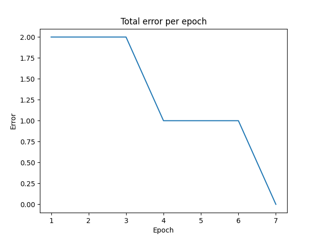

# Logic-Gate-Perceptron

This is a single perceptron model which takes two inputs and predicts the output as if it was a logic gate. The model will only work with linearly separable functions as it's only a single perceptron. This means that given some inputs, can the outputs be separated by a single linear (straight) line?

## Installation and usage

```
git clone https://github.com/elliottcoops/Logic-Gate-Perceptron.git
cd Logic-Gate-Perceptron
python3 -m venv venv
source venv/bin/activate
pip3 install -r requirements.txt
python3 perceptron.py
```

## How it works

Initially, the weights are set to some random floats. We take the sum of the linear combinations of xi * wi and compare it to a threshold value, which in the case of this code is 1. If the sum of the linear combinations of xi * wi > = 1 then output 1, otherwise output 0.

One of the most important things to know about a machine learning model is to know what it's doing and why it's outputting the values that it does. In this case, we are just updating the values of the weights and back-propagating them, while trying to get the lowest possible error based on these inputs.

The code will continue to run until we have a calculated error of 0 across all inputs and outputs, and the epochs are < 1000. If either of these conditions is false then the loop breaks and an appropriate condition is executed.
If the code goes over 1000 epochs, then it's assumed that the function, or values passed in are not linearly separable, and a display message is printed. Otherwise, if the flag converged is set to true, then we know that all errors must be 0, and therefore we don't need to keep looping!

Once we know we have a correct logic gate and values can be predicted correctly:
- The inputs and respective outputs are printed
- A graph of the errors against indexes is printed
- The final calculated weights are printed



## Future improvements

Instead of having two set inputs and two set weights, I could dynamically generate the variables as the user enters the inputs and outputs so that a NOT gate can also be represented.